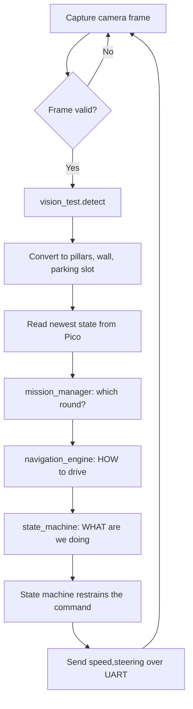
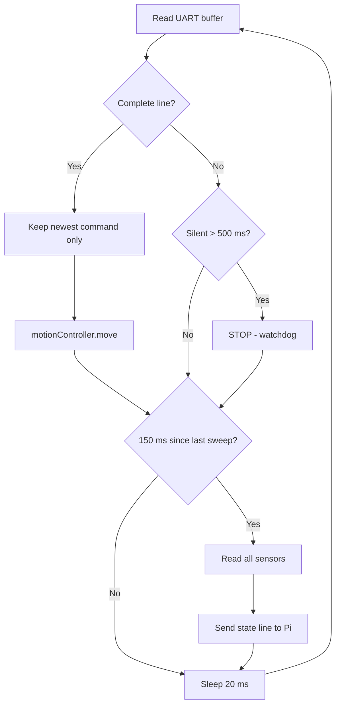
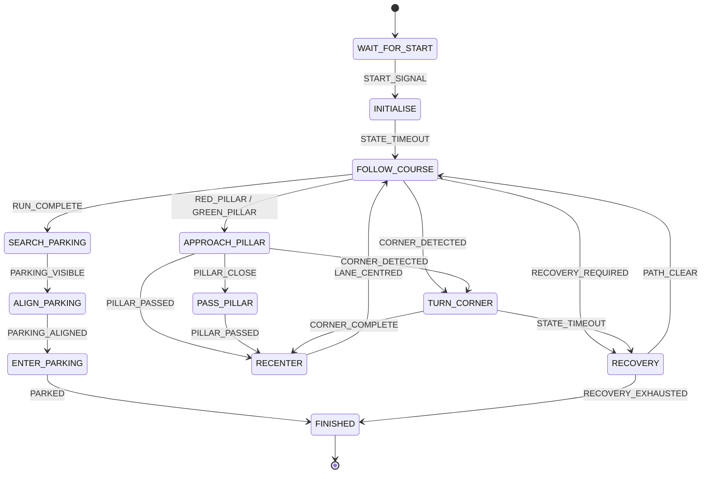

# Software Architecture and Obstacle Strategy

Module structure, flowcharts, the state machine and its rationale, algorithm
justification, edge case handling, and the testing and tuning process.

Covers rubric criterion 3. A beginner level walkthrough of every individual file is in
[other/code-explained.md](../other/code-explained.md).

## Contents

1. [Module Structure](#module-structure)
2. [Control Flow](#control-flow)
3. [The State Machine](#the-state-machine)
4. [Lane Following](#lane-following)
5. [Obstacle Strategy](#obstacle-strategy)
6. [Algorithm Justification](#algorithm-justification)
7. [Edge Cases](#edge-cases)
8. [Testing and Tuning](#testing-and-tuning)
9. [Metrics](#metrics)

## Module Structure

Sixteen modules, 4,071 lines, split across two controllers by timing requirement.

| Module | Board | Responsibility | Lines |
|---|---|---|---|
| `vision_test.py` | Pi | Find signs, wall and parking markers in a frame | 330 |
| `navigation_engine.py` | Pi | Decide speed and steering | 741 |
| `state_machine.py` | Pi | Decide what the robot is doing | 966 |
| `mission_manager.py` | Pi | Report the active challenge | 44 |
| `main.py` | Pi | Coordinate the above, own the serial link | 406 |
| `main.py` | Pico | Receive commands, drive, report state | 190 |
| `motionController.py` | Pico | One interface for movement | 127 |
| `servo.py` | Pico | Steering angle to pulse width | 106 |
| `drv8833.py` | Pico | Speed to motor PWM | 101 |
| `encoder.py` | Pico | Wheel odometry | 126 |
| `sensorManager.py` | Pico | Every reading in one dictionary | 217 |
| `distance.py` | Pico | Four ToF sensors behind the multiplexer | 203 |
| `imu.py` | Pico | Orientation | 185 |
| `colour.py` | Pico | Floor colour | 208 |

### The rule that produced this split

Linux is not a real time operating system. A background process can stall a Python loop
for tens of milliseconds, which is invisible when processing an image and disastrous
when a servo is waiting for its next pulse.

**Anything with a deadline runs on the Pico. Anything that needs to think runs on the
Pi.** Every module placement follows from that.

### Modularity in practice

Three rules kept the modules genuinely separate rather than nominally separate.

**One responsibility each.** `servo.py` knows about pulse widths and nothing about
traffic signs. `navigation_engine.py` knows about steering angles and nothing about
servos.

**Dependencies point one way.** Vision does not import navigation. Navigation does not
import the state machine. The state machine does not import the serial link. Only
`main.py` knows all of them exist.

**Data crosses boundaries as plain dictionaries**, not as objects with behaviour. A
sensor reading is `{"front_distance": 480}`, which any module can read without needing
the class that produced it.

## Control Flow

### The Pi control loop



Seven steps. Step 9 sends the **state machine's** command, never navigation's directly,
so there is exactly one place in the system where a command can reach the wheels.

### The Pico loop



**Two clocks in one loop, on purpose.** Commands are applied every 20 ms because a
command that waits is a robot that has already driven somewhere else. A full sensor
sweep costs about 132 ms, mostly the four ToF measurements, so it runs on its own slower
schedule. A single-speed loop would have added 132 ms of lag to every steering command.

## The State Machine

Twelve states, seventeen events, thirty transitions, three missions.



### Rationale: why a state machine at all

Because the same sensor reading means different things in different situations.

"A wall 500 mm ahead" means a corner is coming while driving a straight. Halfway through
a corner it is just the wall being turned away from. Without a state, every module
re-derives that context independently and they disagree with each other.

### Rationale: why event driven rather than nested conditionals

The design separates **detecting** what happened from **deciding** what to do about it.

`detect_events()` is the only function that knows about millimetres and degrees. The
transition table is the only thing that knows about behaviour, and it contains no numbers
at all.

```python
State.FOLLOW_COURSE: (
    (Event.RUN_COMPLETE,      State.SEARCH_PARKING),
    (Event.RECOVERY_REQUIRED, State.RECOVERY),
    (Event.CORNER_DETECTED,   State.TURN_CORNER),
    (Event.RED_PILLAR,        State.APPROACH_PILLAR),
    (Event.GREEN_PILLAR,      State.APPROACH_PILLAR),
),
```

Three things this buys us.

**Priority is visible.** Row order is priority, so "a wall beats a sign" is a line you
can point at rather than an accident of which `if` was written first.

**Detection can change without touching behaviour.** When corner detection improves,
`detect_events` changes and the table never learns that anything happened.

**Events fire whether or not they matter.** `PATH_CLEAR` is reported every frame the way
ahead is open. `FOLLOW_COURSE` does not list it, so it is ignored. A new state can
consume an existing event without touching detection.

### Rationale: how missions gate states

The Open Challenge has no signs to dodge, so it has no `APPROACH_PILLAR` state. Rather
than writing three state machines, a table says which states each mission has and what
it does instead:

```python
MISSION_SUBSTITUTE["OPEN_CHALLENGE"] = {
    State.APPROACH_PILLAR: None,              # skip this transition
    State.SEARCH_PARKING: State.FINISHED,     # laps done means the run is over
}
```

That second line prevents a real failure. Without it, an open challenge robot would
finish three laps, be told to go and park, find no parking state, and drive forever.

### Rationale: the state machine restrains, never invents

```python
STATE_SPEED_CAP   = {TURN_CORNER: 35, RECOVERY: 30, FINISHED: 0, ...}
STATE_SPEED_FLOOR = {TURN_CORNER: 20, ENTER_PARKING: 15, ...}
```

Navigation always decides how to drive. The state machine may only limit that. `None`
means take whatever navigation asked for.

The **floor** exists because of a real deadlock. Turning towards a wall, the front sensor
keeps closing, so the emergency stop fired mid corner. A stopped robot stops turning, so
the corner never completed, so the state timed out into recovery, and recovery could not
clear because the wall was still there. Four individually correct behaviours chaining
into a dead end. The floor makes the robot creep through instead of freezing.

## Lane Following

```
offset = (right_mm - left_mm) / (right_mm + left_mm)
steering = offset * LANE_GAIN
```

More room on the right means the robot has drifted left, so it steers right.

**Why divide by the total.** It makes the result independent of lane width. One third of
the way across a 1 metre lane and one third across a 2 metre lane give the same answer,
so the robot never needs to be told the track dimensions.

**Why readings over 2000 mm are discarded.** A VL53L0X reports about 8190 mm when it sees
nothing. Fed into that formula it looks like an enormously wide lane, and the robot
steers confidently in the wrong direction.

**Why a dead zone.** Below 0.08 the offset is treated as exactly zero, so sensor jitter
does not keep nudging the wheels.

## Obstacle Strategy

Red on the right, green on the left.

### One calculation instead of nine cases

The obvious implementation is a case per situation: red left, red centre, red right, the
same three for green, plus no sign. Nine branches, nine opportunities for a mistake.

Instead each colour is given a **target position in the frame**:

```python
PASS_TARGET = {COLOUR_RED: -0.5, COLOUR_GREEN: +0.5}
steering = (offset - PASS_TARGET[colour]) * STEERING_GAIN
```

Passing a red sign on its right means the sign ends up on our left, so its target is
-0.5. We steer by however far it is from that target.

| Red sign at | Frame offset | Steering |
|---|---|---|
| Far left | -0.91 | 0, already clear |
| Just left of centre | -0.53 | 0, just cleared |
| Centred | 0.00 | +15 degrees |
| Right of centre | +0.30 | +24 degrees |
| Far right | +0.56 | +30 degrees, full lock |

A centred sign produces the strongest correction and a sign far to one side produces
none. That is correct, and it emerges from the model rather than being written as a rule.

### The clamp that prevents clipping

```python
steering = max(0.0, steering) if colour is RED else min(0.0, steering)
```

A red sign may only ever produce right steering. Without this, a sign already cleared to
the left produces a small correction back towards it, which is exactly how you clip one.

### Choosing between two signs

The nearer sign is the one about to be hit, so that is the one acted on. The far one is
handled on later frames, once it becomes the near one. Distance is used when vision has
measured it; apparent size is the fallback, since a nearer sign of the same real size
looks bigger.

### The four phase pass

`FOLLOW_COURSE` then `APPROACH_PILLAR` then `PASS_PILLAR` then `RECENTER`.

**Recentring is the phase that was missing at first.** The early version steered around a
sign and carried on. Each obstacle left the robot slightly further from the lane centre,
and three signs later it clipped a wall. Now, once the sign has been out of view for
half a second, steering ignores signs entirely and tracks the lane centre until the
offset is back inside the dead zone.

**`PASS_PILLAR` has no route to recovery**, deliberately. Losing sight of a sign you are
squeezing past is what success looks like, so both exits lead to recentring.

### Parking markers as lane boundary

The magenta markers stand on the track for the whole run, not only at the end of it.
The starting straight contains the parking lot, so the robot drives past the markers on
every one of the three laps.

Anything that only looks for magenta while parking cannot see them the rest of the time,
and will knock them over.

So the markers are counted as **boundary**, alongside the black wall, in the same side
bands used for lane keeping. A marker on the left pushes the robot right exactly as a
wall would, using steering logic that already existed.

They are counted separately from the wall rather than merged into it, because while
parking they are the **target** rather than an obstacle. Treating them as boundary then
would steer the robot away from the slot it is trying to enter. One flag,
`avoid_markers`, decides which of the two they are, and it is false only in the parking
modes.

| Situation | Marker on the left | Steering |
|---|---|---|
| Driving a lap | Boundary | Right, away from it |
| Recentring after a sign | Boundary | Right, away from it |
| Searching for the slot | Target | Straight, not pushed off |

## Algorithm Justification

### Why proportional control and not PID

We can implement PID. We chose not to.

A PID controller has three constants that interact: changing one changes what the
correct value of the others would be. Tuning it properly requires repeated tests in the
conditions it will run in.

At a competition you get limited practice time, on an unfamiliar table, under lighting
you did not choose, with two attempts that count. Our steering has **one gain and one
rate limit**. If the robot swings wide, we know which number to change and in which
direction, and any team member can do it.

The derivative term is also the one that would help most, and it is the one most damaged
by noisy sensor readings at 30 frames per second.

**Determinism and tunability beat theoretical optimality when the tuning happens under
pressure.**

### Why HSV and not RGB for colour detection

In RGB, brightness contaminates every channel. A red sign in shadow has a lower red
value than a white wall in sunlight.

HSV separates hue from brightness, so "red" becomes a hue range and the brightness
variation lives in a separate number we can be permissive about.

### Why a fill ratio test on contours

Taking the largest contour locks onto a red jacket in the audience or a stripe of glare
on the mat.

A real sign fills most of its bounding box. Scattered reflections may have a large total
area but are spread out. Requiring area **and** aspect ratio **and** fill ratio rejects
both false positives, and the self test proves it by placing a wide red stripe with the
largest area in the frame and checking the detector skips it.

### Why apparent height for distance

A sign is a known 10 cm tall, so the ratio of real height to pixel height gives range
from a single camera, with no stereo rig and no additional sensor.

The focal length cancels in the clearance calculation, which means the steering geometry
needs no camera calibration at all. Only the reported distance number does.

### Why quaternions from the IMU

The BNO085 reports orientation as a quaternion. We convert to Euler angles for
readability, but the chip works in quaternions because they avoid gimbal lock, a
degenerate case where two rotation axes align and one degree of freedom is lost.

Irrelevant for a ground robot, but it is why the conversion includes a clamp: floating
point rounding can push the `asin` argument fractionally past 1.0 and raise an error.

### Why hysteresis on every threshold

A single threshold with a noisy reading flips state on alternate frames. Readings of
399, 401, 398, 402 against a 400 mm threshold changed the speed mode four times in four
frames, and the robot audibly surged.

Separate enter and exit thresholds mean a reading near the boundary cannot cause a
change.

### Why a steering rate limit

One bad detection can only move the wheels 6 degrees rather than slamming them to full
lock. Full lock takes five frames, about 170 ms at 30 fps, which is fast enough to react
and slow enough that noise does not reach the servo.

## Edge Cases

| Case | Handling | Where |
|---|---|---|
| Sign flickers out for one frame | Half a second of confirmation before the pass ends | state machine |
| Two signs visible at once | Nearest wins; list order is irrelevant | navigation |
| Sign appears during a corner | Corner outranks sign, by table row order | state machine |
| Blob below minimum area | Treated as noise | vision |
| Sign jitters at frame centre | Dead zone snaps offset to zero | navigation |
| Distance sensor returns nothing | Speed drops to slow rather than cruising blind | navigation |
| Both side sensors fail mid corner | Hold the turn already in progress | navigation |
| Nothing detected at all | Fall back to lane following | navigation |
| Red jacket in the audience | Fill ratio test rejects it | vision |
| Magenta parking marker | Separate hue band; red narrowed to avoid overlap | vision |
| Only one parking marker visible | Not treated as a slot; keep searching | state machine |
| Robot wedged against a wall | Encoder stall detection triggers recovery | state machine |
| Corner never completes | Timeout to recovery, floor prevents the freeze | state machine |
| Pi crashes or cable drops | Watchdog stops the robot after 500 ms | Pico |
| Camera frame drops | Skip it, try again | Pi main |
| Corrupt byte on the serial link | Decoded with errors ignored | Pi main |
| Missing sensor driver file | That sensor reports itself; others keep working | Pico sensors |

## Testing and Tuning

### The testing workflow

**Level 1, module self tests.** Every module carries a `selftest()` that runs on a
laptop with no hardware. Fifteen of the sixteen modules are covered. They run in
milliseconds, so they run constantly during development.

```
python3 navigation_engine.py --selftest
python3 state_machine.py --selftest
```

**Level 2, structural assertions.** The tests we value most check the shape of the code
rather than a value, because they catch a half finished edit:

```python
assert set(TRANSITIONS) == set(State)          # every state has a transition row
assert PARKING_STOP_MM < STOP_ENTER_MM         # the parking trigger is reachable
assert set(MISSION_STATES) == set(Mission)     # every mission is described
```

**Level 3, cross board contract test.** The Pico's self test loads the **Pi's actual
parser**, not a copy, and checks a state line round trips through it. That is how we know
both boards agree on the message format.

**Level 4, bench testing.** One subsystem at a time, wheels off the ground, in the order
recorded in [the test log](../other/engineering-journal/test-logs.md).

**Level 5, field testing.** Full runs on a mat.

### The tuning process

<!-- TODO: record actual tuned values and what they were before. -->

| Constant | What it changes | How to tune |
|---|---|---|
| `STEERING_GAIN` | How hard the robot corrects for a sign | Raise if it clips signs, lower if it swerves wide |
| `STEERING_MAX_CHANGE_DEG` | How fast the wheels can move | Lower is smoother, higher reacts faster |
| `LANE_GAIN` | How hard it corrects lane drift | Raise if it wanders, lower if it weaves |
| `PASS_TARGET_OFFSET` | How wide a berth signs get | Raise for more clearance |
| `CORNER_TRIGGER_MM` | When a corner begins | Raise to turn earlier |
| `CRUISE_SPEED` | Straight line speed | Raise until the robot stops finishing reliably, then back off |

**Change one at a time.** Two changes at once and you cannot attribute the difference.

## Metrics

Numbers we use to judge whether a change helped.

### Measured

| Metric | Value | How |
|---|---|---|
| Vision pipeline cost | **0.32 ms per frame** | Timed over 300 frames on a development laptop |
| Modules with self tests | **15 of 16** | The sixteenth is a shell script |
| State machine size | 12 states, 17 events, 30 transitions | |
| Sensor sweep cost | ~132 ms | Four ToF at 33 ms each |
| Pico command latency | under 20 ms | Loop period |

The vision figure is the one that mattered most: at 0.32 ms per frame, the camera's
frame rate limits the robot rather than the processing. That is the right way round, and
it is why we downscale to 320 pixels rather than optimising further.

### To be measured

<!-- TODO: these are the metrics that will validate performance on the mat.
     The rubric asks specifically for "metrics used to validate performance". -->

| Metric | Target | Measured |
|---|---|---|
| Laps completed out of attempts | | |
| Signs passed correctly out of signs encountered | | |
| Corners completed without recovery | | |
| Parking success rate | | |
| Time for three laps, Open | | |
| Time for three laps, Obstacle | | |
| Frames per second on the Pi 3 | | |
| Recovery events per run | | |
